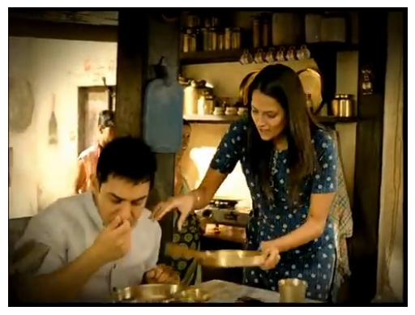

# The Culture Repository

## Introduction

Welcome to the Cultural Repository! This project aims to capture the intricate cultural details of different cultures that are often not available on conventional sources like Wikipedia. We focus on extracting these details from visual media, such as advertisements, movies, and vlogs targeted at specific cultures.

## Culture
Culture is a multifaceted and complex construct, influencing human behavior, communication, and interaction [[1]](https://arxiv.org/pdf/2406.03930), highlighting various dimensions of culture in language technologies such as through linguistic variations, social norms, values, and communication styles. However culture is a dynamic and evolving concept, influenced by historical, social, and political factors [[2]](https://arxiv.org/pdf/2203.10020), resulting in a complex interplay of cultural elements. 


> Crucially, some cultural nuances are so deeply ingrained within a society that they are often implicit rather than explicitly documented.These subtle yet significant aspects of culture can be challenging to capture in textual formats like Wikipedia articles but are often vividly portrayed in visual media. In contrast, visual media often offers a richer and more authentic representation of cultural phenomena, enabling a deeper understanding of cultural intricacies.

<table>
  <tr>
    <td> </td>
    <td></td>
    <td></td>
    
   </tr> 
   <tr>
      <td>Brazil: "kkkkkk" used for laughs</td>
      <td>India: Steel utensils, Open shelving, Kurta</td>
     <td>USA: Bold pink hair color, Chunky necklace, Abstract Painting</td>
  </td>
  </tr>
</table>


As of now we are associating culture with countries. While culture transcends national borders and encompasses regional, ethnic, and social group identities, restricting cultural analysis within country boundaries can be a practical starting point as it allows for more focused and detailed analysis before expanding to more granular cultural subdivisions.

## Data Sources

Our database is built using videos from:
- [YouTube](https://www.youtube.com/)
- [Ads of the World](https://www.adsoftheworld.com/)
- [AdForum](https://www.adforum.com/)

This repository utilizes visual data from above platforms. We acknowledge and respect the copyright and ownership of all content, which remains with the original creators.


## Methodology

In videos we identify key frames using scene detection, quality checks to ensure they capture relevant cultural elements. We analyzed frames using a Culture vocabulary to extract the cultural cues present in it by a automated pipeline using LLM's and VLM's. Data is organized by country folders with frames, metadata, and cultural annotations in a detailed vocabulary file.

## Vocabulary
<details>
<summary><strong>1. Regular Practices</strong></summary>
<ul>
  <li><strong>Language and Communication</strong>
    <ul>
      <li>Idioms, slang, and common phrases</li>
      <li>Gestures and body language</li>
    </ul>
  </li>
  <li><strong>Food and Dining</strong>
    <ul>
      <li>Cuisine and traditional dishes</li>
      <li>Cooking methods</li>
      <li>Dining etiquettes</li>
      <li>Kitchen design</li>
      <li>Cutlery</li>
    </ul>
  </li>
  <li><strong>Clothing and Fashion</strong>
    <ul>
      <li>Traditional clothing</li>
      <li>Dress codes for different occasions</li>
      <li>Hair and beard types</li>
      <li>Accessories and jewelry</li>
    </ul>
  </li>
  <li><strong>Home Design and Decoration</strong>
    <ul>
      <li><strong>Exterior Styles</strong>
        <ul>
          <li>Roof design</li>
          <li>Entrance</li>
        </ul>
      </li>
      <li><strong>Functional Elements</strong></li>
      <li><strong>Interior Design</strong>
        <ul>
          <li>Furniture styles</li>
          <li>Antique or vintage pieces</li>
          <li>Wall coverings</li>
        </ul>
      </li>
      <li><strong>Celebrations</strong>
        <ul>
          <li>Festivals</li>
          <li>Ceremonies (e.g., birth, wedding)</li>
          <li>Decorations</li>
        </ul>
      </li>
      <li><strong>Religion and Spirituality</strong>
        <ul>
          <li>Religious practices</li>
          <li>Religious icons</li>
          <li>Places of worship/religious buildings</li>
          <li>Mythical creatures or heroes</li>
        </ul>
      </li>
    </ul>
  </li>
</ul>
</details>

<details>
<summary><strong>2. Creative Expressions</strong></summary>
<ul>
  <li><strong>Art and Music</strong>
    <ul>
      <li>Traditional and contemporary music</li>
      <li>Visual arts (painting)</li>
      <li>Murals, graffiti, sculptures</li>
      <li>Performing arts (dance and theater)</li>
    </ul>
  </li>
  <li><strong>Entertainment and Leisure</strong>
    <ul>
      <li>Popular sports</li>
      <li>Recreational activities</li>
      <li>Movies, shows, books</li>
      <li>Hobbies</li>
    </ul>
  </li>
</ul>
</details>

<details>
<summary><strong>3. Social Structure</strong></summary>
<ul>
  <li><strong>Family and Society</strong>
    <ul>
      <li>Parenting styles</li>
      <li>Family roles and responsibilities</li>
      <li>Legends or inspirational people</li>
    </ul>
  </li>
  <li><strong>Education and Work</strong>
    <ul>
      <li>Work ethics</li>
      <li>Type of work/employment</li>
      <li>Educational system</li>
      <li>Attitude towards hierarchy</li>
    </ul>
  </li>
</ul>
</details>

<details>
<summary><strong>4. Environment and Public Life</strong></summary>
<ul>
  <li><strong>Public Spaces</strong>
    <ul>
      <li>Urban design</li>
      <li>Architecture and buildings</li>
      <li>Historic monuments and statues</li>
      <li>Transportation</li>
    </ul>
  </li>
  <li><strong>Natural Environment</strong>
    <ul>
      <li>Vegetation/plants/trees</li>
      <li>Animals and wildlife</li>
      <li>Agricultural elements</li>
      <li>Sacred plants and animals</li>
    </ul>
  </li>
  <li><strong>Signage, Symbols, and Flags</strong>
    <ul>
      <li>Script</li>
      <li>Multilingual signs</li>
      <li>National emblems</li>
      <li>Flags</li>
      <li>National color schemes</li>
    </ul>
  </li>
</ul>
</details>


## Explore

To explore the repository, go to page [The-Culture-Repository](https://behavior-in-the-wild.github.io/the-culture-repository.html#)

## Citation

If you use or reference our work, please cite it as follows:

```bibtex
@online{jha2024culture,
    author = {Jha, Ritika and Garikaparthi, Aniketh and Bhattacharyya, Aanisha and Kumar, Yaman},
    title = {The Culture Repository},
    year = {2024},
    url = {https://behavior-in-the-wild.github.io/the-culture-repository.html}
}

